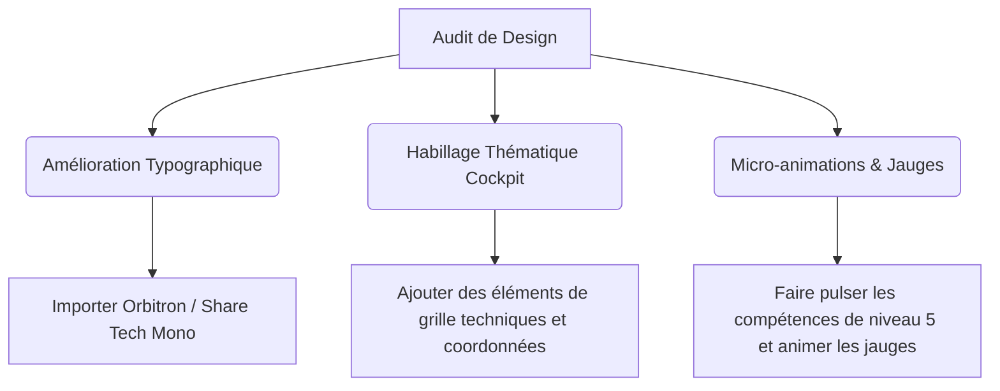

# Audit de Design Frontend - SkyCenter Trombinoscope

Ce document présente un audit esthétique et ergonomique de l'application **SkyCenter Trombinoscope**, réalisé selon les principes directeurs de la compétence **Frontend Design** (choix typographiques marqués, identité visuelle propre, et intégration d'éléments de signature).

---

## 1. Synthèse de l'Identité Visuelle et Concept

L'application possède une **identité thématique très forte et originale** axée sur l'aéronautique militaire (squadrons, avions, plans de vol, cockpit) combinée à un aspect ludique de cartes à collectionner (TCG).

*   **Sujet** : Un trombinoscope d'entreprise augmenté d'un outil de réservation de bureaux et d'un gestionnaire de repas (kebab).
*   **Public cible** : L'équipe interne de SkyCenter.
*   **Axe esthétique** : "Fleet Management / Cockpit", alliant modernité épurée (glassmorphism) et éléments ludiques (croissants "Chocoblasts", cartes de combat de pilotes).

---

## 2. Points Forts (Strengths)

### 🚀 Élément Signature mémorable (Le TCG Card Exporter)
L'application propose un véritable élément signature : la possibilité d'exporter la fiche d'un collaborateur sous forme de **carte à collectionner TCG**.
*   **Le design de la carte** (dans `StaffCard.tsx`) simule un cockpit d'avion avec un indicateur de puissance global basé sur la somme des niveaux de compétences ("Power Level").
*   Le bouton d'exportation en PNG via `html-to-image` avec copie directe dans le presse-papiers est une fonctionnalité premium qui suscite l'engagement des utilisateurs.

### 🎨 Thématique sémantique et lexicale cohérente
Le jargon aéronautique est appliqué avec beaucoup de rigueur sur toute l'interface :
*   Les équipes deviennent des **Escadrilles** (*squadrons*).
*   Le planning de présence hebdomadaire devient le **Plan de Vol** (*flight plan*).
*   Les bureaux deviennent des **Appareils** (*aircrafts*).
*   L'intégration d'icônes FontAwesome cohérentes (avions au décollage/atterrissage, éclairs de puissance, médailles de certifications) renforce cette cohérence visuelle.

### 🌓 Mode Sombre (Dark Mode) natif et soigné
*   L'interface gère nativement la bascule jour/nuit avec une transition CSS fluide.
*   Les variables de couleur et les classes Tailwind s'adaptent de manière soignée (passant d'un fond bleu-ciel léger à un bleu nuit spatial profond `#020617` / `slate-950`).

---

## 3. Points Faibles (Weaknesses) & Pistes d'Amélioration

### 🔤 Faiblesse 1 : Typographie neutre et standard (Opportunité manquée)
*   **Constat** : L'application utilise la police système par défaut (`font-sans` du navigateur). C'est le point faible esthétique le plus flagrant : l'interface a l'air d'un template standard alors qu'elle devrait ressembler à un tableau de bord aéronautique ou un jeu de cartes futuriste.
*   **Recommandation** : Importer des polices Google Fonts spécifiques :
    *   **Police Display (Titres / Cartes)** : `Orbitron` ou `Share Tech Mono` (polices au look technologique, cockpit, instrumentation de vol).
    *   **Police Body (Lecture)** : `Outfit` ou `Plus Jakarta Sans` (géométriques, modernes, très lisibles).

### 📐 Faiblesse 2 : Structure et mise en page conventionnelle (Layout)
*   **Constat** : En dehors des cartes individuelles, la structure globale de la page (barre de recherche, boutons de filtres alignés au centre, grille standard) reste très "dashboard passe-partout".
*   **Recommandation** : Donner un look plus "fiche technique" ou "tableau de bord de hangar" en ajoutant des bordures fines décoratives (hairlines), des coordonnées techniques dans les coins des sections (ex: `[FLT-PLN // SEC-01]`), ou une disposition asymétrique.

### 🌀 Faiblesse 3 : Manque de micro-animations
*   **Constat** : Les transitions sur les survols sont correctes (effet d'échelle sur les cartes), mais il manque un sentiment de dynamisme (les jauges de compétences pourraient s'animer au chargement, la bascule de mode sombre pourrait être accompagnée d'une transition plus orchestrée).
*   **Recommandation** : Ajouter des micro-animations sur les badges de compétences (effet de pulsation sur le niveau maximum) et des transitions d'entrée animées lors du chargement des escadrilles.

### 📭 Faiblesse 4 : Pages vides (Empty States) trop neutres
*   **Constat** : Lorsqu'une recherche ne donne aucun résultat, ou lorsqu'il n'y a pas de session kebab ou de bureau défini, l'écran vide est assez générique.
*   **Recommandation** : Personnaliser les messages avec le ton de la thématique : "Aucun pilote détecté dans les radars" (avec un radar radar factice clignotant), ou "Hangar vide, aucun appareil configuré".

---

## 4. Plan de Refactoring Esthétique (Proposition)

Pour transformer cette application d'un "bon produit" à un projet au design "WOW" premium, voici les étapes recommandées :



### Exemples d'intégration CSS pour la typographie (dans `index.html`) :
```html
<link rel="preconnect" href="https://fonts.googleapis.com">
<link rel="preconnect" href="https://fonts.gstatic.com" crossorigin>
<link href="https://fonts.googleapis.com/css2?family=Orbitron:wght@700;900&family=Plus+Jakarta+Sans:ital,wght@0,400;0,600;0,800;1,400&family=Share+Tech+Mono&display=swap" rel="stylesheet">
```

### Modification des classes de police :
*   Titre principal de l'application & Titres des cartes TCG : `font-['Orbitron']` ou `font-['Share_Tech_Mono']`.
*   Description et bio : `font-['Plus_Jakarta_Sans']`.
